# Dockling

A live, per-session duck in your macOS Dock for Claude Code, showing what each session is doing in real time.

See [DOCKLING_SPEC.md](./DOCKLING_SPEC.md) for the full design rationale. This README covers what's actually built and how to run it today.

## What it does

- One Dock icon per active Claude Code session (not one aggregate icon), driven by Claude Code's [hook system](https://docs.claude.com/en/docs/claude-code/hooks).
- Each session's duck gets a random color from a 9-color pool, avoiding colors currently in use by other active sessions; that color is then remembered per project (see [Per-project colors](#per-project-colors)).
- Hovering a Dock icon shows the project name.
- The duck's pose changes in real time with what that session is doing — see the [Duck Key](#duck-key) below for exactly what each pose means and when it shows up.
- Sound effects: a short cue plays when a session becomes ready for your next message, and another when it's specifically waiting on you to answer something — each independently toggleable (see [Configuration](#configuration)).
- Each subagent a session spawns gets its own duck too — same color as its parent, 80% her size — that appears while the subagent's working and disappears shortly after it reports back. Capped at 3 baby ducks per session by default, so a big burst of subagents doesn't take over the Dock. See [Subagent ("baby") ducks](#subagent-baby-ducks). Both the ducks themselves and the cap can be turned off — see [Configuration](#configuration).

## Duck Key

| | Pose | When it shows |
|---|---|---|
| 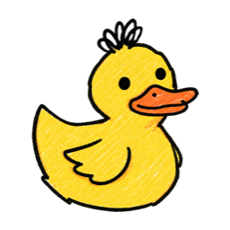 | **Idle** | A session just started, or a turn ended without calling any tools |
|  | **Running a shell command** | A Bash/shell tool call is in progress |
| 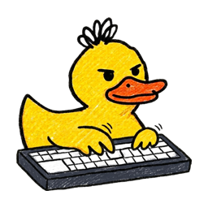 | **Editing a file** | A file-editing tool call is in progress |
| 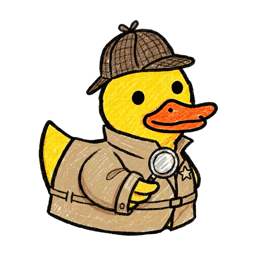 | **Searching or reading** | A web search or codebase search/read tool call is in progress |
| 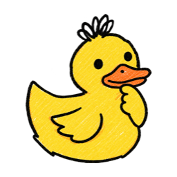 | **Using a tool** | Any other tool call — also shown right after you send a new message, standing in for "thinking," since there's no hook for when the model actually starts generating |
| 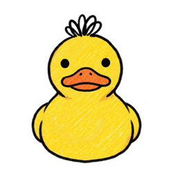 | **Waiting on you** | Claude Code needs your input or permission to continue |
| 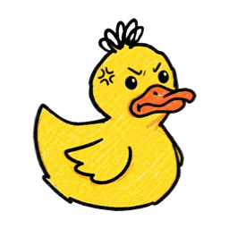 | **Error** | A tool call failed |
| 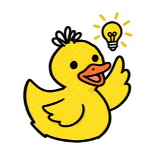 | **Task complete** | A turn that did real work (called at least one tool) finished successfully, or a todo-list-style milestone completed |
| 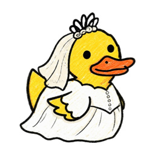 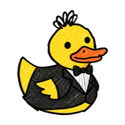 | **Committing** | Running `git commit` — bride or groom formalwear, picked randomly once per session/subagent process, not configurable |
| 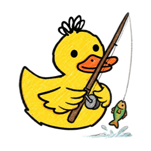 | **Pulling** | Running `git pull` |
| 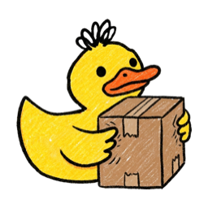 | **Pushing** | Running `git push` |
| 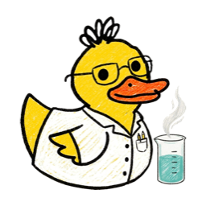 | **Running tests** | Running a test suite — `pytest`, `jest`, `npm test`, and similar |
| 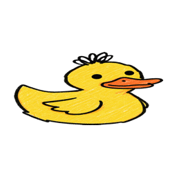 | **Compressing or compacting** | Running `zip`/`tar`/`gzip`/etc. — also shown when Claude Code compacts its own context |
| 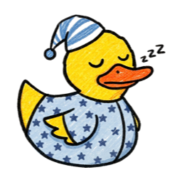 | **Idle 5+ minutes** | No activity for 5 minutes straight; any activity wakes the duck right back up |
| 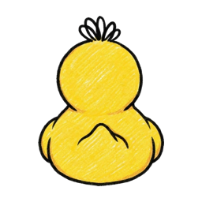 | **Session ending** | Shown for 1.5s right before the duck exits, as the session ends |

Shown here in yellow — the actual color is per-project, not per-pose (see [Per-project colors](#per-project-colors)). This same key is also shown in-app, in the settings window.

## Requirements

- macOS
- Swift toolchain (Xcode Command Line Tools is enough — `xcode-select --install`), only if building from source (Option B below) — the downloaded DMG (Option A) ships a prebuilt binary and needs nothing beyond macOS itself.

## Setup

### Option A: download (no Terminal, no Swift toolchain)

1. Install via Homebrew:

   ```sh
   brew install --cask abbykatz23/dockling/dockling
   ```

   Or download the latest signed, notarized DMG from [Releases](https://github.com/abbykatz23/dockling/releases), open it, and drag Dockling to Applications.
2. Open Dockling from Applications (or Spotlight) and click **Install**. This wires Dockling into `~/.claude/settings.json` so *every* Claude Code session on your machine reports its state — not just sessions run from inside a checkout of this repo — and registers it to start automatically at login. A window opens right after with your settings (see [Configuration](#configuration)) and the [Duck Key](#duck-key). Opening Dockling again later reopens this same window, where you can also change settings, Update, Reinstall, or Uninstall.
3. Start or continue any Claude Code session. A duck appears in the Dock once the session's first hook fires (`SessionStart`, or the first tool call in some clients).

To uninstall, double-click Dockling in Applications again and click **Uninstall** — see [Uninstalling](#uninstalling).

### Option B: from source

1. **Build and register the hooks.** Same clean-merge guarantee as above: your existing hooks (for any event, any tool) are left untouched, and re-running this is always safe.

   ```sh
   ./install/install.sh
   ```

   This also generates a per-install secret at `~/.dockling/secret`, required on every hook request so no other local process can spoof an event.

2. **Run the dispatcher.** This is the one long-lived process; it listens on port 8765 and spawns a child process (and Dock icon) per session.

   ```sh
   ~/.dockling/bin/DocklingAgent --dispatcher &
   ```

   Or set it up as a `launchd` agent so it starts automatically at login and restarts itself if it ever crashes:

   ```sh
   ./install/install_launchd.sh
   ```

3. **Start or continue any Claude Code session.** A duck appears in the Dock once the session's first hook fires (`SessionStart`, or the first tool call in some clients).

   To uninstall:

   ```sh
   ~/.dockling/bin/DocklingAgent --uninstall
   ```

   See [Uninstalling](#uninstalling) for exactly what this removes.

## Uninstalling

Either double-click Dockling in Applications and click **Uninstall** (with a confirmation step first), or run:

```sh
~/.dockling/bin/DocklingAgent --uninstall
```

Both remove the same things:

- Dockling's own hook entries from `~/.claude/settings.json` — a clean removal, same guarantee as install: any other tool's hooks (or your own, for any event) are left exactly as found.
- The `launchd` registration, so it no longer starts at login.
- Every currently-running Dockling process — the dispatcher and any live session/subagent ducks.
- `~/.dockling` itself, including your saved config, per-project colors, and secret.

This can't be undone — a later reinstall starts from scratch (fresh per-project colors, default config) rather than restoring what was there before.

## Updating

Open Dockling (in Applications) and use the **Check for Updates** button in the settings window — no need to download a new DMG or drag anything to Applications by hand:

1. Click **Check for Updates**. If a newer release exists, the button changes to **Update to &lt;version&gt;**.
2. Click it again to download, verify, and install that release. The background dispatcher (and every live duck) is already running the new version by the time this finishes — nothing further needed for that part.
3. You'll be offered **Relaunch Now** so the settings window (and Dockling.app in Applications) picks up the new version too — **Later** is fine either way, since the part that matters for your ducks is already updated.

This checks `github.com/abbykatz23/dockling`'s latest release, verifies it's signed and notarized (the same check Gatekeeper itself would do) and signed by the same developer as the copy you already have installed, before installing it — never an arbitrary/unverified download. Not available for a from-source build (nothing to update *to* via this path — use `git pull` + rebuild instead).

**Reinstall vs. Update** — the settings window also has a **Reinstall** button, which does something different: it re-registers hooks and restarts the background process using whatever's *already installed*, without checking for anything newer. Use it to repair a broken install (hooks got wiped by hand-editing `~/.claude/settings.json`, the `launchd` registration got removed, etc.) — Update won't help there, since as far as it's concerned nothing's out of date.

## Per-project colors

- First session in a project: a color is picked at random, avoiding colors already in use by another currently-active session, then persisted to `~/.dockling/projects.json` keyed by the project's absolute path.
- Every later session in that same project reuses the persisted color, so it stays stable across restarts.
- To pin a color explicitly (e.g. to check a fixed character into a repo for collaborators), add a `.dockling` file at the project root:

  ```
  color: green
  ```

  Valid colors: `yellow`, `blue`, `babyblue`, `gray`, `green`, `lavender`, `orange`, `pink`, `tan`. A dotfile pin always wins over a persisted assignment.

## Subagent ("baby") ducks

- The first time a session's subagent makes a tool call, Dockling spawns her a duck: same color as the parent ("mama"), 80% the size, positioned to mama's left.
- When a subagent reports back (its `SubagentHandback` call — the reliable "I'm done" signal; Claude Code doesn't have a separate subagent-start/stop event pair), her duck shows the eureka pose briefly, then disappears.
- The Dock has no public API to control icon order — it's just launch order among running apps, with no way to group or reorder. To keep a family visually together with mama rightmost, the whole family (every current baby, then mama) relaunches itself under a new pid each time a new baby joins, becoming the most-recently-launched block again. This causes a brief visible flicker across the whole family — a deliberate trade-off, chosen over leaving families to get split apart by other sessions' activity in between.
- Each relaunch is best-effort, not a documented Dock guarantee, and only triggers on a *new* baby joining (removing one doesn't reshuffle the rest, since Dock order doesn't need it to).

## Configuration

Create `~/.dockling/config.json` to change any of these (missing keys/file fall back to the defaults below — there's nothing to set up for the common case):

```json
{
  "subagent_ducks": false,
  "limit_subagent_ducks": false,
  "sound_effects_ready": false,
  "sound_effects_awaiting_input": false
}
```

- `subagent_ducks` (default `true`): when off, subagents don't get their own duck, and their activity has no effect on mama's icon either — it's as if they're invisible. The whole family-relaunch mechanism (see below) also never triggers, since it exists solely to keep babies grouped with mama.
- `limit_subagent_ducks` (default `true`): caps a session at 3 baby ducks at once. A session that fans out many subagents in a burst can otherwise spawn a baby duck per subagent with no ceiling, which crowds the Dock fast. Subagents beyond the cap simply don't get a duck — their actual work is unaffected. The cap itself (3) isn't configurable, only this on/off switch.
- `sound_effects_ready` (default `true`): when off, the "ready for your next message" cue (on `Stop`) never plays.
- `sound_effects_awaiting_input` (default `true`): when off, the "waiting on you" cue (on `Notification`) never plays.

All four of these can also be toggled from the settings window.

Read once at process startup (dispatcher and every session child each load their own copy), so a change takes effect on the next restart, not live.

## Architecture

- **Dispatcher** (`DocklingAgent` run with no args): the one stable process, bound to the well-known hook port. Never appears in the Dock itself. On each new `session_id`, spawns a child process and hands it a dynamically allocated port.
- **Session child** (`DocklingAgent --session <id> --port <port> --color <color> --name <project>`): owns exactly one Dock icon (`NSApp.applicationIconImage`), launched through a synthesized per-project `.app` bundle so the Dock's hover tooltip shows the real project name. Exits when its session ends.
- **Auth**: every hook request (both real Claude Code hooks and the dispatcher's internal forwards to a child) must carry `?token=<secret>` matching `~/.dockling/secret`, or it's rejected.
- **Restart resilience**: the dispatcher persists its session table (pid/port/color per session) to `~/.dockling/sessions.json` and reconciles with it on startup — adopting still-running children instead of spawning duplicates, and dropping anything no longer alive. This is what makes the `launchd` `KeepAlive` restart-on-crash behavior safe. Baby ducks aren't in this registry (only mama tracks her own babies, in-memory) — a dispatcher restart while subagents are active can orphan their ducks, same trade-off the top-level registry exists to avoid.
- **Icon assets**: `--install` copies them to `~/.dockling/resources`, and every Dock icon loads from there rather than from inside the repo checkout. Loading straight out of the checkout (via SPM's `Bundle.module`) would trigger a macOS permission prompt on every single session/subagent spawn if the repo happens to live under Downloads, Desktop, or Documents — a real risk given how often people clone into Downloads by default.

## Known limitations

- No official Claude Code plugin listing yet — Homebrew and the signed, notarized DMG on [Releases](https://github.com/abbykatz23/dockling/releases) are the two install paths today.
- Subagent ("baby") ducks can occasionally leak as orphaned background processes across many family relaunches in one very long session — not yet root-caused. Harmless individually, but they aren't tracked by the dispatcher's own restart-resilience registry (see [Architecture](#architecture)), so only a full restart or [Uninstall](#uninstalling) reliably clears them, not just reopening the app.
- No telemetry of any kind (this is intentional, not a gap — see `DOCKLING_SPEC.md`).

## License

MIT — see [LICENSE](./LICENSE).
